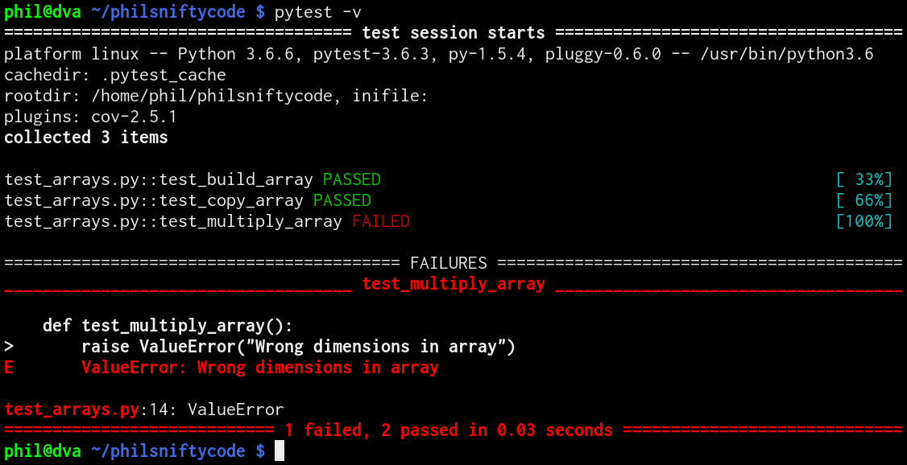

# Make it right, then make it go fast enough

<div class="right">
    
</div>

Phil Tooley and Will Furnass

Research Software Engineering team, University of Sheffield

2019-01-24

---
## Outline

1. Writing performant code
    * Gauging Performance
    * Parallelising code
    * Other acceleration techniques
1. Creating sustainable software
    * Version control
    * Testing
    * Documentation
    * Packaging and dissemination
1. Further Resources and RSE Sheffield

---
## Writing Performant Code

<div class="middle">
    <div class="center">
        
    </div>
</div>

---
## Writing Performant Code

* Ignore code performance **until it works**!
* Once it works, look for "hot spots" that:
    * Take a long time to execute
    * Are executed many times

???

Write correct code then make it fast, pass on wisom from MathWorks

---
## Profiling Code

* *Is* my code genuinely slow?
  * Consider time cost to improve code
  * Performance of similar codes?
<p style="margin-bottom:10px"><p/>
* *Where* is my code slow?
* *Why* is my code slow?
<p style="margin-bottom:10px"><p/>  

Sometimes code is as fast as it can really be, in that case look for other approaches like
parallelism.

---
## Development/optimisation cycle

<div class="middle">
    <div class="center">
        
    </div>
</div>

---
## Profiling Tools

* Various types of profiling tool:
  * Line profilers
  * Function profilers
  * Memory profilers
  * Instrumentation - add code to the program to output extra information

* Use results to guide where time is spent on improving code

* Specific tools:
  * C/C++/Fortran: `gprof` (free); Intel vTune (£££)
  * Python: `cProfile`

---
## Example: cProfile output

```
$ python profile_fibonacci_raw.py
RAW
================================================================================
[0, 1, 1, 2, 3, 5, 8, 13, 21, 34, 55, 89, 144, 233, 377, 610, 987, 1597, 2584, 4181, 6765]

         57356 function calls (66 primitive calls) in 0.746 CPU seconds

   Ordered by: standard name

   ncalls  tottime  percall  cumtime  percall filename:lineno(function)
       21    0.000    0.000    0.000    0.000 :0(append)
       20    0.000    0.000    0.000    0.000 :0(extend)
        1    0.001    0.001    0.001    0.001 :0(setprofile)
        1    0.000    0.000    0.744    0.744 <string>:1(<module>)
        1    0.000    0.000    0.746    0.746 profile:0(print fib_seq(20); print)
        0    0.000             0.000          profile:0(profiler)
 57291/21    0.743    0.000    0.743    0.035 profile_fibonacci_raw.py:13(fib)
     21/1    0.001    0.000    0.744    0.744 profile_fibonacci_raw.py:22(fib_seq)
```

---
## Example: Flame graph


---
## Parallelising Code

* Traditional HPC codes are data parallel
* All processes perform same tasks on different sections of problem
* Data parallelism can be achieved by:
  * Shared memory (SHM) - all processes can access same memory space
  * Message passing (MP) - processes must explictly communicate all shared data
  * Parallel accelerators - GPUs and intel MIC

* Choose platform suited to problem

---
## Parallelising Code

* Less "traditional" approaches:
  * Cluster computing frameworks (Hadoop, Spark etc)
  * Heterogeneous programs
  * Streaming computation
  * Directed acyclic graphs (e.g. workflow managers like NextFlow, Ruffus)

* All approaches have their place
* Consider program structure to find a good fit

---
## Parallelising Code

* Low level parallel libraries:
  * OpenMP - SHM primitives for C/C++/Fortran
  * MPI - MPI standard implemented by many vendors, for many languages
  * CUDA - Run many parallel threads on Nvidia GPUs
  * OpenACC - OpenMP-like primitives for GPU/Intel MIC offload
  * Intel TBB - threading building blocks for parallel applications

* No maths here, just communication

---
## But don't reinvent the wheel

* Higher level maths libraries available, e.g:
  * General high-perf math - GSL, MKL, NAG
  * Linear Algebra - LaPACK, BLAS, Intel MKL
  * ODE/PDE solvers - PETSc, PVODE, FEniCS
  * Scientific frameworks - PETSc, Trilinos
  * Cluster computing - Dask, Hadoop, Spark 
  * Domain specific frameworks

* Use appropriate frameworks to develop more reliable code

---
## Other acceleration methods

* Language choices:
  * Python/MATLAB are very common in science
  * C/C++/Fortran used for larger codes
  * Some Mathematica/IDL/R also

* Typically we consider C/C++/FORTRAN as "fast" while interpreted languages like python are "slow"

---
## Accelerating Python

* Use **Numpy** to efficiently operate on 1, 2 or n-dimensional data 
    * numpy's 'Vectorised' operations much faster than for loops

      ```ipython
      In [6]: %timeit [x**2 for x in range(100000)]                                                                                                                                                
      22.5 ms ± 74.8 µs per loop (mean ± std. dev. of 7 runs, 10 loops each)

      In [7]: %timeit np.power(np.arange(100000), 2)                                                                                                                                               
      619 µs ± 1.98 µs per loop (mean ± std. dev. of 7 runs, 1000 loops each)
      ```
    * More concise code as assign n-dim array to variable (good or bad?)

---
* **Scipy**: 
  * lots of useful functions for numerical work
  * inc. linear algebra
  * Much of back-end written in C or Fortran for performance 

* **Numba**: compile Python functions on the fly!
  * Speed of C using pure Python syntax
  * Numba even works on GPUs!
  * Works well in conjunction with Numpy
  * Useful if Numpy not enough 
      * e.g. require iterative approach

* **Cython**: write Python-like code that compiles to C
  * Useful if require finer-grained control of memory allocation
  * Useful for multi-threaded code
    * can release a global lock when running code in non-Python mode
  * Also great for creating Python wrappers around existing C/C++ libraries
  * To get best performance you have to make code look less Pythonic and more like C

* Or explicitly write numerical code in C/C++

---
## Testing: Why?

<div class="middle">
    <div class="center">
        
    </div>
</div>

.footnote[.red.bold[*] Randall Munroe, XKCD (https://xkcd.com/1909/)] 

---
## Testing: Types

  * Testing early and often helps catch mistakes
  * Ideally test at two different scales:
      * Every function should have accompanying tests (unit tests)
          * Ensure functions give correct output for correct input
          * Graceful failures with invalid input
          * These should be run every time the code is changed
      * Test full program behaviour (integration tests)
          * Identify useful test cases with known results
          * Test on different machines/architectures
      * Regression tests: check against previous versions

---
## Testing: Frameworks

* Tools to automate running of tests
* Programmer: 
    * writes test functions
    * provides expected output
    * sets PRNG seed?
* Framework runs all tests and provides report

---
* Examples:
    * C++: `Boost.Test`
    * Python: `py.test`

<div class="middle">
    <div class="center">
        
    </div>
</div>

---

## Testing: Continuous Integration

* **Automatically** build and test code after changes
* **Immediate feedback on bugs/mistakes!**
* Test in a variety of **clean** environments
    * e.g. different permutations of OS version and dependency versions
* Collaborate with more confidence
* Free services for open source projects!

<div class="middle">
    <div class="center">
        
    </div>
</div>

---
## Learning more / getting help

* **Workshops**
    * RSE team runs various workshops on fundamentals:
        * UNIX shell, Git, Python/R/MATLAB, relational databases...
    * and more advanced topics:
        * multithreading/multiprocessing, CUDA, deep learning...
    * CiCS also offer training in C/C++, Fortran, Python, MATLAB and HPC
* **Talks**
    * RSE seminar series 
* **Code Clinic**
    * Book an appointment to get help with a coding issue

For more info (inc. **mailing list** and events schedule) see [https://rse.shef.ac.uk/][https://rse.shef.ac.uk/]

---
## Getting more help

* Hire an RSE to help with your project(s)!
    * Either as part of a grant proposal
    * Or just for a few days

Examples of projects...

---
## Conclusions


### Contact

<i class="fa fa-globe fa-lg"></i>&nbsp;[https://rse.shef.ac.uk](https://rse.shef.ac.uk)

<i class="fa fa-envelope fa-lg"></i>&nbsp;[rse@sheffield.ac.uk](maito://rse@sheffield.ac.uk)

<i class="fa fa-github fa-lg"></i>&nbsp;[@RSE-Sheffield](https://github.com/RSE-Sheffield/RSE-Sheffield.github.io)

<i class="fa fa-twitter fa-lg"></i>&nbsp;[@RSE_Sheffield](https://twitter.com/rse_sheffield)

---
## TO INTEGRATE OR DROP

### RSE@Sheffield


* What RSE team is/does
  * Variety of projects and skills
  * UK RSE
  * EPSRC Fellowships


### IO
 - sensible, robust binary formats
 - buffering
 - parallel IO
 - choice of filesystem

### Benchmarking
 
 - Run entire program or section of code to provide baseline
    - Ensure you have record of circumstances under which this captured (version of code, software stack, OS, hardware resources, core placement (if using MPI)

Useful tools
unix time
timeit (where can control number of runs/repeats and can specify init

```sh
$ python3 -m timeit '"-".join(str(n) for n in range(100))'
10000 loops, best of 5: 30.2 usec per loop
```
SGE logs

```sh
$ qacct -j 3059981 
qsub_time    Wed Jan 23 21:29:30 2019
start_time   Wed Jan 23 21:29:42 2019
end_time     Wed Jan 23 21:49:49 2019
granted_pe   mpi                 
slots        4                   
ru_wallclock 1207s
ru_utime     810.633s
ru_stime     270.002s
cpu          1080.635s
maxvmem      341.039MB
```
