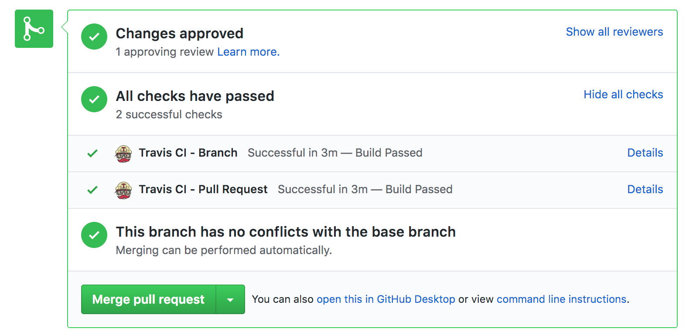
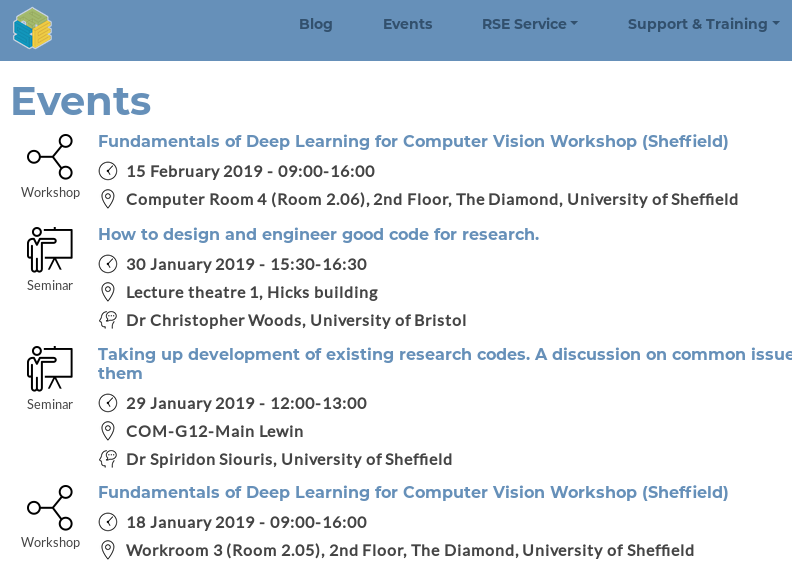

# Make it right, then make it go fast enough

<div class="right">
    
</div>

Phil Tooley and Will Furnass

Research Software Engineering team, University of Sheffield

2019-01-24

---
## Outline

1. Writing performant code
    * Gauging Performance
    * Parallelising code
    * Other acceleration techniques
    * Accelerating Python
1. Creating sustainable software
    * Documentation
    * Version control
    * Testing
1. Further Resources and RSE Sheffield

---
## Writing Performant Code

<div class="middle">
    <div class="center">
        
    </div>
</div>

---
## Writing Performant Code

* Ignore code performance **until it works**!
* Once it works, look for "hot spots" that:
    * Take a long time to execute
    * Are executed many times
* Keep testing to ensure nothing breaks!

<div class="middle">
    <div class="center">
        
    </div>
</div>


???

Write correct code then make it fast, pass on wisdom from MathWorks
---
### Benchmarking
 
* Run your code to provide a baseline
* Record all the variables:
  * Code Version
  * Software stack
  * Hardware and resources

* Useful tools
  * Unix `time`
  * SGE `qacct`
  * Python `timeit` - useful for snippets

---
## Benchmarking

* Unix Time

  ```sh
  user@sharc-node001 ~ $ time ./my_program

  real    0m4.442s
  user    0m0.760s
  sys     0m0.136s
  ```

* Python Timeit

  ```sh
  $ python3 -m timeit '"-".join(str(n) for n in range(100))'
  10000 loops, best of 5: 30.2 usec per loop
  ```

---
## Benchmarking

* SGE logs

  ```sh
  $ qacct -j 3059981 
  qsub_time    Wed Jan 23 21:29:30 2019
  start_time   Wed Jan 23 21:29:42 2019
  end_time     Wed Jan 23 21:49:49 2019
  granted_pe   mpi                 
  slots        4                   
  ru_wallclock 1207s
  ru_utime     810.633s
  ru_stime     270.002s
  cpu          1080.635s
  maxvmem      341.039MB
  category     -u ab1xyz -l h_rt=86400,h_vmem=4G -P rse
  ```
---
## Profiling Code

* *Is* my code genuinely slow?
  * Consider time cost to improve code
  * Performance of similar codes?
<p style="margin-bottom:10px"><p/>
* *Where* is my code slow?
* *Why* is my code slow?
<p style="margin-bottom:10px"><p/>  

Sometimes code is as fast as it can really be, in that case look for other approaches like
parallelism.

---
## Profiling Tools

* Various types of profiling tool:
  * Line profilers
  * Function profilers
  * Memory profilers
  * Instrumentation - add code to the program to output extra information

* Use results to guide where time is spent on improving code
---
## Profiling Tools
* C/C++/Fortran:
  * perf (free)
  * gprof (free)
  * Intel vTune (£££)
  * Arm MAP (£££)
  * Valgrind suite (free)
* Python
  * memory-profiler (free)
  * line_profiler (free)
  * pyflame (free)
* Matlab
  * Inbuilt profiling tools

---
## Example: Line profiler output

```
#    Mem usage   Increment   Line Contents
================================================
236  307.5 MiB   307.5 MiB  @profile(stream=LogFile('pfire_mprof'))
237                         def make_tmat(fixed, reg, mask, dmap):
238                             """Create the T^t T and T^t(f-m) matrices
239                        
240                             This is a very memory hungry step.
241                             """
242  307.5 MiB     0.0 MiB      diff = (reg+fixed)/2 * mask
243                              # don't try to differentiate z if 2D
244  307.5 MiB     0.0 MiB      grads = np.gradient(diff)
245  307.5 MiB     0.0 MiB       diff = diff.reshape(-1)
246  307.5 MiB     0.0 MiB      grads = [gd.reshape(-1) for gd in grads]
247                             # do in two ops so can be done in place
248  307.5 MiB     0.0 MiB      diff -= 1
249  307.5 MiB     0.0 MiB      diff *= -1
250  307.5 MiB     0.0 MiB      mask = sps.diags(dmap.mask_nodes.reshape(-1), 0)
251  307.5 MiB     0.0 MiB      tmat = sps.hstack(
252  665.2 MiB   357.7 MiB          [dmap.basis.multiply(gd.reshape((-1,1))) @ mask 
253                                  for gd in grads] +
254  767.4 MiB   102.2 MiB          [dmap.basis.multiply(diff.reshape((-1,1))) @ mask])

```

---
## Example: Flame graph


---
## Parallelising Code

* Traditional HPC codes are data parallel
* All processes perform same tasks on different sections of problem
* Data parallelism can be achieved by:
  * Shared memory (SHM) - all processes can access same memory space
  * Message passing (MP) - processes must explictly communicate all shared data
  * Parallel accelerators - GPUs and intel MIC

* Choose platform suited to problem

---
## Parallelising Code

* Less "traditional" approaches:
  * Cluster computing frameworks (Hadoop, Spark etc)
  * Heterogeneous programs
  * Streaming computation
  * Directed acyclic graphs (e.g. workflow managers like NextFlow, Ruffus)

* All approaches have their place
* Consider program structure to find a good fit

---
## Parallelising Code

* Low level parallel libraries:
  * OpenMP - SHM primitives for C/C++/Fortran
  * MPI - MPI standard implemented by many vendors, for many languages
  * CUDA - Run many parallel threads on Nvidia GPUs
  * OpenACC - OpenMP-like primitives for GPU/Intel MIC offload
  * Intel TBB - threading building blocks for parallel applications

* No maths here, just communication

---
## But don't reinvent the wheel

* Higher level maths libraries available, e.g:
  * General high-perf math - GSL, MKL, NAG
  * Linear Algebra - LaPACK, BLAS, Intel MKL
  * ODE/PDE solvers - PETSc, PVODE, FEniCS
  * Scientific frameworks - PETSc, Trilinos
  * Cluster computing - Dask, Hadoop, Spark 
  * Domain specific frameworks

* Use appropriate frameworks to develop more reliable code

---
## Other acceleration methods

* Language choices:
  * Python/MATLAB are very common in science
  * C/C++/Fortran used for larger codes
  * Some Mathematica/IDL/R also

* Typically we consider C/C++/Fortran as "fast" while interpreted languages like python are "slow"

---
## Accelerating Python

* Use **Numpy** to efficiently operate on 1, 2 or n-dimensional data 
    * Numpy's 'Vectorised' operations much faster than for loops

      ```ipython
      In [6]: %timeit [x**2 for x in range(100000)]                                                                                                                                                
      22.5 ms ± 74.8 µs per loop (mean ± std. dev. of 7 runs, 10 loops each)

      In [7]: %timeit np.power(np.arange(100000), 2)                                                                                                                                               
      619 µs ± 1.98 µs per loop (mean ± std. dev. of 7 runs, 1000 loops each)
      ```
    * Understands multi-dimensional arrays (no arrays of arrays)

---
## Accelerating Python

* **Scipy**: numerical science toolkits
  * Numerical calculus and optimization
  * Linear algebra
  * Signal processing
  * Statistics
  * Much of back-end written in C or Fortran for performance 

---
## Accelerating Python

* **Numba**: compile Python functions on the fly!
  * Speed of C using pure Python syntax
  * Numba even works on GPUs!
  * Fully integrated with Numpy
  * Write custom Numpy functions
  * Some limitations on compilable code

---
## Accelerating Python

* **Cython**: write Python-like code that compiles to C
  * Useful if require finer-grained control of memory allocation
  * Useful for multi-threaded code
    * can release a global lock when running code in non-Python mode
  * Also great for creating Python wrappers around existing C/C++ libraries
  * To get best performance you have to make code look less Pythonic and more like C

* Or explicitly write numerical code in C/C++

---
## Sustainable Software

<div class="middle">
    <div class="center">
        
    </div>
</div>


.footnote[ Randall Munroe, XKCD (https://xkcd.com/844/)] 

---
## A Common Problem 

* Emailed a zip of source files:


* How do I run this?
* What exactly will it do?
* How do I interpret the output?

---
## A Better Experience 


---
## A Better Experience 


---
## Version Control

* Version Control Systems (VCS/Git)
  * Keep a full history of changes
  * Easily restore old versions
  * Develop multiple versions together
  * Try things out without consequences
  * Share code and develop collaboratively

* Various out there but `Git` is most common

---
## Github

<div class="right">
    
</div>
  * Online git repositories
  * Public repos for open source
  * Free private repos for education and research
  * Impact and engagement tracking
  * Community building tools:
    * Bug reporting/tracking
    * Documentation hosting
    * Project wikis

---
## Testing: Why?

<div class="middle">
    <div class="center">
        
    </div>
</div>

.footnote[ Randall Munroe, XKCD (https://xkcd.com/1909/)] 

---
## Testing: Types

  * Testing early and often helps catch mistakes
  * Ideally test at two different scales:
      * Every **function** should have accompanying tests (**unit** tests)
          * Ensure functions give correct output for correct input
          * Graceful failures with invalid input
          * These should be run every time the code is changed
      * Test **full program** behaviour (**integration** tests)
          * Identify useful test cases with known results
          * Test on different machines/architectures
      * **Regression** tests: check against **previous versions**

---
## Testing: Frameworks

* Tools to automate running of tests
* Programmer: 
    * writes test functions
    * provides expected output
    * sets PRNG seed?
* Framework runs all tests and provides report

---
* Examples:
    * C++: `Boost.Test`
    * Python: `py.test`

<div class="middle">
    <div class="center">
        
    </div>
</div>

---

## Testing: Continuous Integration

* **Automatically** build and test code after changes
* **Immediate feedback on bugs/mistakes!**
* Test in a variety of **clean** environments
    * e.g. different permutations of OS version and dependency versions
* Collaborate with more confidence
* Free services for open source projects!

<div class="middle">
    <div class="center">
        
    </div>
</div>

---
### Example: Travis job status for GitHub Pull Request
<div class="middle">
    <div class="center">
        
    </div>
</div>

---
## Research software: learning more / getting help

* **Workshops**
    * RSE team runs various workshops on fundamentals:
        * UNIX shell, Git, Python/R/MATLAB, relational databases...
    * and more advanced topics:
        * multithreading/multiprocessing, CUDA, deep learning...
    * CiCS also offer training in C/C++, Fortran, Python, MATLAB and HPC

---
## Research software: learning more / getting help

* **Talks**
    * RSE seminar series 
* **Code Clinic**
    * Book an appointment to get help with a coding issue
* **Hire an RSE** to help with your project(s)!
    * Either as part of a grant proposal
    * Or just for a few days

---
For more info (inc. **mailing list** and events schedule) see [https://rse.shef.ac.uk/](https://rse.shef.ac.uk/).

<div class="middle">
    <div class="center">
        
    </div>
</div>

---
## The RSE team

* 9 RSEs
* Team kick-started by 2x EPSRC fellowships
* Based in Computer Science
* Some current projects:
    * High-performance **agent-based modelling** (CUDA)
    * Deep learning and workflows for **NLP**
    * MRI **image alignment** (registration) software (C++/PETSc)
    * Agile **web apps** for visualising datasets (R/Shiny)
    * Augmenting **cell modelling** software (C++/PETSc)

---
## Getting in touch

<i class="fa fa-globe fa-lg"></i>&nbsp;[https://rse.shef.ac.uk](https://rse.shef.ac.uk)

<i class="fa fa-envelope fa-lg"></i>&nbsp;[rse@sheffield.ac.uk](maito://rse@sheffield.ac.uk)

<i class="fa fa-github fa-lg"></i>&nbsp;[@RSE-Sheffield](https://github.com/RSE-Sheffield/RSE-Sheffield.github.io)

<i class="fa fa-twitter fa-lg"></i>&nbsp;[@RSE_Sheffield](https://twitter.com/rse_sheffield)
